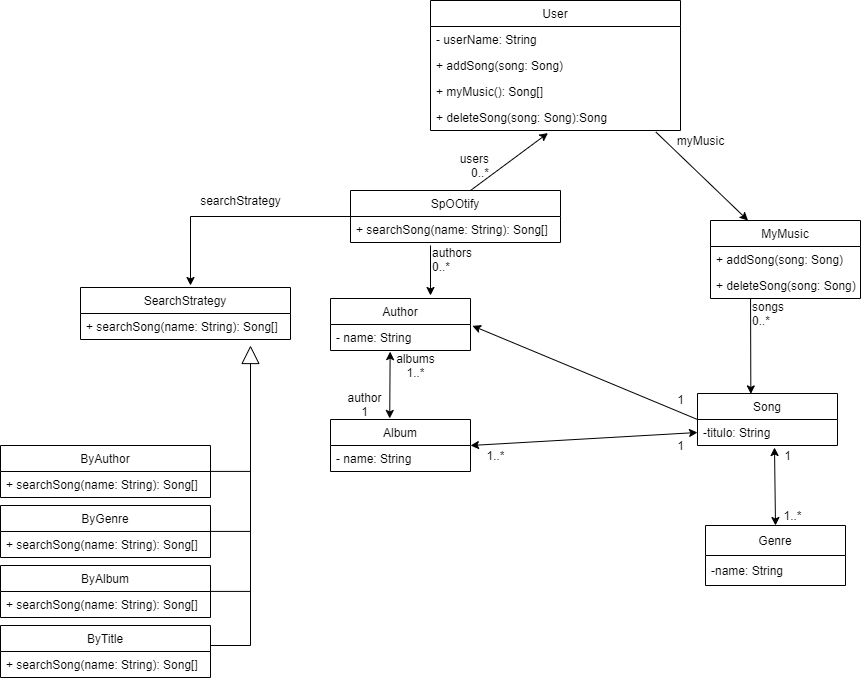

# OO2

Este repositorio al igual que todos los comenzados en POO_ estan hechos con el proposito de mostrar 
ejercicios hechos durante la materia OO2.
En esta materia enseñan y realizan ejercicios relacionados a los patrones de diseño.

Practica 5: Introducción a **refactoring. Test Driven Development y métodos ágiles. Patrones de XUnit. Test doubles.**

# Practica 5 Ejercicio 1: SpOOtify
SpOOtify es, obviamente, la versión orientada a objetos de Spotify. En Spotify cada usuario puede buscar obras musicales de diferentes maneras: por autor, por género, por album. Los usuarios pueden agregar las canciones a una lista privada conocida como My Music. Obviamente también puede remover temas de My Music. De cada autor se conocen sus álbumes y de cada álbum sus temas. SpOOtify conoce a los autores y a partir de allí, a todos los temas. SpOOtify conoce a los usuarios. Se pide implementar los mensajes necesarios para poder ofrecer la siguiente funcionalidad:

- **buscar por título**: dado un String retorna una lista de temas cuyo título contiene o es igual al String pasado como parámetro. La búsqueda es case insensitive.
- **buscar por autor**: dado un String retorna una lista con los temas cuyo nombre de autor contiene o es igual al String recibido como parámetro. La búsqueda es case insensitive.
- **buscar por álbum**: dado un String retorna una lista con los temas cuyo título de álbum contiene o es igual al String recibido como parámetro. La búsqueda es case insensitive.
- Además, el usuario debe ser capaz de agregar y quitar temas de su lista privada de música favorita.
				
## **Tareas**:				
1. Realice el diseño usando un diagrama de clases UML. Verifique el diseño con un ayudante.
2. Planifique qué tipo de pruebas desea hacer para los mensajes propuestos en el enunciado.
3. Implemente los casos de prueba en JUnit. 
4. Implemente en Java el modelo de SpOOtify.

## SOLUCION

1. 
2. Empezando a hacer los [Tests necesarios](/test/java/ar/edu/unlp/info/oo2/practica5_ejercicio1/)
3. y 4. Realizando de a poco la [implementacion](/main/java/ar/edu/unlp/info/oo2/practica5_ejercicio1/) de los casos de JUnit a mi solucion.